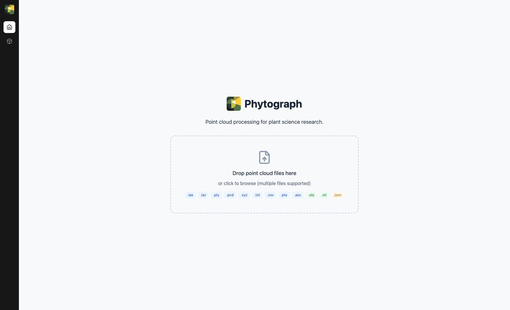

# Your first import

Let's load a scan and look at it in 3D. You'll need a point cloud
file — any `.las`, `.laz`, `.ply`, `.pcd`, `.xyz`, `.txt`, `.csv`,
`.pts`, or `.asc` will do. A small scan from a single tripod position
is the easiest way to see how the app works before moving on to large
multi-position datasets.

## Open the app

When you launch Phytograph you land on the **Home** tab — a large
drop zone for importing files.

{ width="900" }

The left rail has two main areas:

- :material-home: **Home** — file import and supported-format chips
- :material-cube-outline: **Viewer** — the 3D workspace where everything happens

The Home tab summarizes Phytograph's purpose ("Point cloud processing
for plant science research") and shows which file extensions you can
drop here: `.las`, `.laz`, `.ply`, `.pcd`, `.xyz`, `.txt`, `.csv`,
`.pts`, `.asc`, `.obj`, `.stl`, `.json`.

## Import the file

You have three ways to import:

=== "Drag and drop"

    Drag the file from your file manager onto the drop zone in the Home
    tab. Phytograph auto-detects the format.

=== "Import button"

    Click the **Import** button in the toolbar. Use the dropdown chevron
    next to it to force a specific format (Point Cloud, Mesh, Skeleton)
    if auto-detection picks the wrong one.

    { width="320" }

=== "Command palette"

    Press <kbd>⌘</kbd>+<kbd>K</kbd> (macOS) or <kbd>Ctrl</kbd>+<kbd>K</kbd>
    (Windows) and type "import".

A progress indicator appears while the file is parsed. ASCII files in
the multi-million-point range typically import in a few seconds; LAS/LAZ
binary formats are faster still.

## See it in 3D

Phytograph automatically switches to the **Viewer** tab and centers the
camera on your data.

{ width="900" }

Try the basic camera controls:

- **Rotate**: left-click drag on the 3D canvas
- **Pan**: right-click drag (or middle-click drag)
- **Zoom**: mouse wheel
- **Reset**: click the **Reset View** button in the top toolbar

On the right, the **Scans** panel lists everything currently loaded
(meshes and skeletons get their own panels below it once present).
For each scan row you have:

- :material-eye: a visibility toggle
- a color dot showing how it's drawn (more on this in
  [Color modes](../reference/color-modes.md))
- the point count
- :material-close: a remove button

A scan can also carry [scan parameters](../concepts/scans.md) like the
scanner origin — you'll see additional controls on the row when those
are attached.

The cloud is colored by height (Z-axis) by default — taller parts of the
plant in yellow-green, lower parts in deep blue. This is one of seven
[color modes](../reference/color-modes.md) you can switch between.

## What's next

Now that you have a scan loaded, take the
**[Tour of the interface](interface-tour.md)** to see what every panel
and toolbar button does. Or jump straight to a workflow:

- **[Clean a point cloud](../workflows/clean-point-cloud.md)** — crop out the ground, remove outliers
- **[Triangulate a mesh](../workflows/triangulate.md)** — reconstruct surfaces
- **[Extract a skeleton](../workflows/extract-skeleton.md)** — get branching topology
