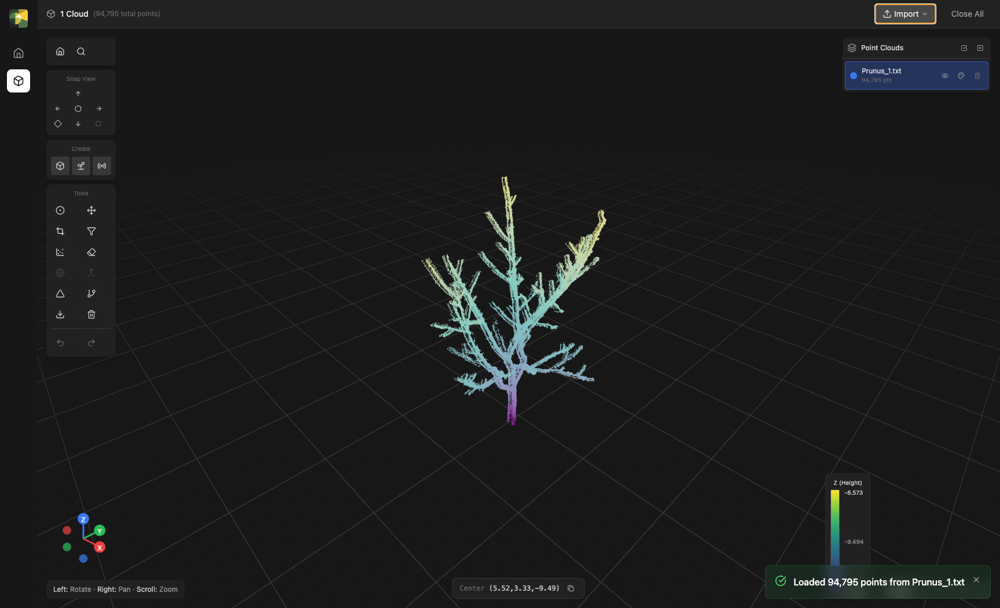
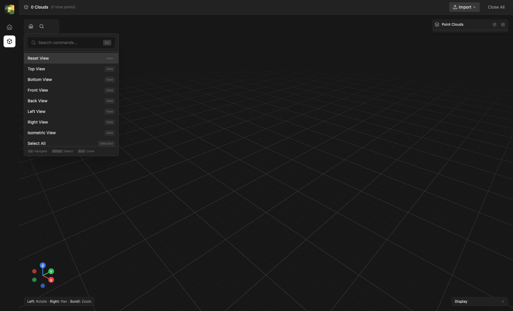

# Tour of the interface

This page is a reference map of the Viewer — what each region is and what
lives there. Skim it once to know where things are; you don't need to
memorize anything.

{ width="980" }

## Top bar

| Region | What's there |
|---|---|
| Top-left | Phytograph logo and the current scene summary ("N Clouds, M Meshes…") |
| Top-center | The active mode label |
| Top-right | **Report a Bug** and **Request a Feature** buttons (see [Reporting bugs & requesting features](feedback.md)) |

Import is via **drag-and-drop** onto the window or the **File → Import**
menu — choose **Auto-detect**, or an explicit **Point Cloud**, **Mesh**,
or **Skeleton** when auto-detection picks the wrong type for an ambiguous
format like `.ply`. To remove scans, select them in the **Scans** panel
and delete.

## Left tool column

A vertical column down the left side. At the top are the **view** controls
(reset camera, command-palette search) and the **snap-view** gizmo. Below
those are two always-visible blocks — **Create** and **Tools**:

| Block | Buttons |
|---|---|
| **Create** (build the scene) | Generate Plant, Import Model, Create Voxel Grid, Create Plane, Add Scan |
| **Tools** › Pre-processing | Translate, Crop, Erase, Filter, Resample, Move to Origin, Align (ICP), Stitch |
| **Tools** › Segmentation | Segment Ground, Segment Wood / Leaf, Segment Trees |
| **Tools** › Reconstruction | Triangulate, Extract Skeleton, Build QSM, Leaf Area Density |

**Create** is kept separate from **Tools** on purpose: Create *builds* a
scene (generating geometry, placing scanners), whereas Tools *operate on
data you already have*. The Tools block holds only the three analysis
stages of a typical pipeline. Synthetic scanning (**Simulate**) has no
left-column block of its own — run it from the **Simulate** menu (**Run
Synthetic Scan**) or the **Run Synthetic LiDAR Scan** button at the top of
the **Scans** panel once a scanner is placed.

Hover any button to see its name. Buttons no longer appear and disappear
with your selection — they're always shown so you can see what's available.

- **Single-input tools** (Filter, Segment Ground, Triangulate, …) act on the
  selected cloud. They're greyed out until you select one; the tooltip tells
  you what to pick.
- **Multi-input tools** (Align, Stitch, Leaf Area Density) stay enabled and
  open a dialog where you pick their inputs explicitly — for example, Leaf
  Area Density lets you choose the scans and the voxel grid. If a needed
  input doesn't exist yet, the dialog tells you.

Everything in these blocks is also in the menu bar — under the **Tools**,
**Create**, and **Simulate** menus, grouped the same way — and in the
[command palette](#command-palette).

The same operation can often be reached from a tool's results, too — running
a Helios triangulation, for instance, defines the voxel grid that the Leaf
Area Density dialog then reuses automatically.

## Bottom-left view gizmo

A small XYZ orientation gizmo and a row of view-snapping buttons:
**Left**, **Right**, **Front**, **Back**, **Top**, **Bottom**, plus
**Isometric**. Click any button to rotate the camera to that view — it
only reorients (Z stays up), keeping your current target and zoom rather
than reframing. The gizmo tracks the current orientation; clicking one of
its axis heads does the same thing. After snapping you can still orbit
freely. To reframe, use **Reset View** (fit all) or **Zoom to Selection**.

## 3D canvas

The main interactive area. Camera controls:

| Action | Mouse | Trackpad |
|---|---|---|
| Orbit | Left-click drag | One-finger drag |
| Pan | Right-click drag, or ⌘/Ctrl + left-click drag | Two-finger drag |
| Zoom | Scroll wheel | Pinch |
| Set focus point | Double-click an object | Same |
| Zoom to selection | <kbd>F</kbd> (or the **Zoom to Selection** toolbar button) | Same |

The 1m × 1m grid on the world XY plane gives you a fixed sense of
scale; lighter lines every 10 cm let you eyeball details.

## Right-side scene panel

Three stacked lists — **Scans**, **Meshes**, **Skeletons**.
Each scan entry shows:

- a color dot (also acts as a selection indicator); click it to pick a
  custom per-scan color, which drives the **Per-scan color** mode
- the scan label and a subtitle (point count, scanner origin, or both)
- visibility, duplicate, and remove controls
- a paperclip to attach point data (if the scan only has parameters)
- a radio icon to add scan parameters (if the scan only has data)
- an expand chevron that reveals the full parameter readout

The **duplicate** button (a copy icon) makes an independent copy of the
scan — its point data *and* any scan-parameter metadata — named
`… (copy)` (then `… (copy 2)`, and so on). The copy is fully separate:
editing, cropping, or deleting one never affects the other. It's handy
for branching experiments — run two different crops or segmentations off
the same import, or place a second scanner with the same sweep settings.

A scan can hold point data, scan parameters (origin, sweep, return mode),
or both — see [Scans](../concepts/scans.md) for details.

Multi-select with <kbd>Shift</kbd>+click (range) or
<kbd>⌘/Ctrl</kbd>+click (toggle). Single-input tools (Filter, Segment, …)
act on the current selection, so being deliberate about what's selected
matters; multi-input tools (Stitch, Align, Leaf Area Density) seed their
dialog from the selection but let you change it there.

### Bulk show/hide and delete

Each list's header has an **eye** and a **trash** button that act on
multiple entries at once:

- With one or more rows **selected**, they apply to just the selection —
  "hide the 3 selected scans", "delete the 2 selected meshes".
- With **nothing selected**, they apply to the whole list — hide or show
  every entry, or clear the list.

The eye button toggles to a single uniform state: if any target is
visible it hides them all; press again to show them all. A bulk delete
asks for confirmation **once** for the whole batch, rather than once per
entry. The same multi-select + header buttons work for **Meshes**,
**Skeletons**, and **QSM** results.

The **colormap legend** in the bottom-right shows the current
scalar-to-color mapping (e.g., height in meters → viridis). Different
color modes change the legend.

## Bottom status bar

Cursor world coordinates ("X, Y, Z"), the active modifier-state
indicators (Left/Right/Scroll meanings depending on tool), and the
last operation's status message (e.g., *"Loaded 84,795 points from
scan.xyz"*).

## About / version info

Open **Phytograph → About Phytograph** (macOS) or **Help → About
Phytograph** (Windows/Linux) to see the versions Phytograph is running:
the **Application** and **Backend** versions, plus the **PyHelios** and
**Helios (C++)** engine versions. These are handy to quote when reporting
a bug — the same numbers are auto-attached to the
[bug/feature reports](feedback.md) you send from within the app.

## Command palette

Press <kbd>⌘</kbd>+<kbd>K</kbd> (macOS) or <kbd>Ctrl</kbd>+<kbd>K</kbd>
(Windows) anywhere in the Viewer to open a searchable list of
commands.

{ width="980" }

The palette is the fastest way to find a feature when you don't
remember which button hides it. Start typing to filter; press
<kbd>Enter</kbd> to run the highlighted command, <kbd>Esc</kbd> to
close.

## Undo / redo

<kbd>⌘/Ctrl</kbd>+<kbd>Z</kbd> undoes the last edit;
<kbd>⌘/Ctrl</kbd>+<kbd>Y</kbd> redoes it. Undo covers the whole scene:
adding objects (import, triangulate, generate plant, extract skeleton, build
QSM, compute LAD), deleting them, transforms (move/rotate/scale), pre-bake
erase/crop edits, stitching, and renaming/recoloring. Deleting several selected
objects undoes in a single step. View settings (visibility, color mode, point
size, camera) are not undoable. A few destructive operations that rewrite point
data or recreate a backend session — baking edits, segmentation, ICP
registration, and plant morph/age changes — are one-way: instead of being
reversible they clear the undo history for the affected object.

## What's next

Pick a workflow that matches what you want to do:

- **[Clean a point cloud](../workflows/clean-point-cloud.md)**
- **[Triangulate a mesh](../workflows/triangulate.md)**
- **[Extract a skeleton](../workflows/extract-skeleton.md)**
- **[Generate a plant](../workflows/generate-plant.md)**
- **[Register & compare](../workflows/register-compare.md)**
- **[Simulate a LiDAR scan](../workflows/simulate-scan.md)**
