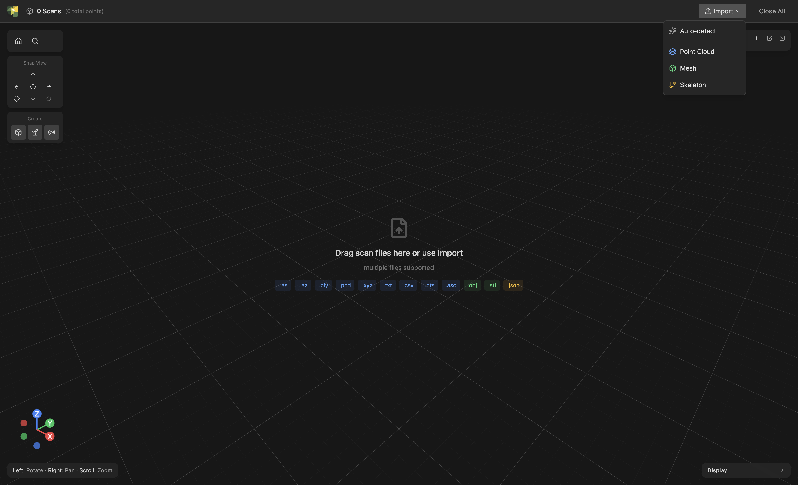

# Tour of the interface

This page is a reference map of the Viewer — what each region is and what
lives there. Skim it once to know where things are; you don't need to
memorize anything.

{ width="980" }

## Top bar

| Region | What's there |
|---|---|
| Top-left | Phytograph logo and the current scene summary ("N Clouds, M Meshes…") |
| Top-center | The active mode label |
| Top-right | **Import** button (with a chevron for the format dropdown), **Close All** |

Hover the **Import** chevron to choose **Auto-detect**, **Point Cloud**,
**Mesh**, or **Skeleton** — useful when auto-detection picks the wrong
type for ambiguous formats like `.ply`.

{ width="900" }

## Left tool column

A vertical column of icon buttons down the left side. Each opens a
panel or tool mode. Hover any button to see its name. The exact set
depends on what's selected in the scene panel; tool buttons that
require a selection are disabled until you pick something.

## Bottom-left view gizmo

A small XYZ orientation gizmo and a row of view-snapping buttons:
**Left**, **Right**, **Front**, **Back**, **Top**, **Bottom**, plus
**Isometric**. Click any button to snap the camera. The gizmo tracks the
current orientation; clicking one of its axis heads looks straight down
that world axis (Z stays up) without changing your zoom. After snapping
you can still orbit freely.

## 3D canvas

The main interactive area. Camera controls:

| Action | Mouse | Trackpad |
|---|---|---|
| Orbit | Left-click drag | One-finger drag |
| Pan | Right-click drag, or ⌘/Ctrl + left-click drag | Two-finger drag |
| Zoom | Scroll wheel | Pinch |
| Frame an object | Double-click an object | Same |

The 1m × 1m grid on the world XY plane gives you a fixed sense of
scale; lighter lines every 10 cm let you eyeball details.

## Right-side scene panel

Three stacked lists — **Scans**, **Meshes**, **Skeletons**.
Each scan entry shows:

- a color dot (also acts as a selection indicator); click it to pick a
  custom per-scan color, which drives the **Per-scan color** mode
- the scan label and a subtitle (point count, scanner origin, or both)
- visibility and remove controls
- a paperclip to attach point data (if the scan only has parameters)
- a radio icon to add scan parameters (if the scan only has data)
- an expand chevron that reveals the full parameter readout

A scan can hold point data, scan parameters (origin, sweep, return type),
or both — see [Scans](../concepts/scans.md) for details.

Multi-select with <kbd>Shift</kbd>+click (range) or
<kbd>⌘/Ctrl</kbd>+click (toggle). Many operations (Stitch, Align, Filter)
act on the current selection, so being deliberate about what's selected
matters.

### Bulk show/hide and delete

Each list's header has an **eye** and a **trash** button that act on
multiple entries at once:

- With one or more rows **selected**, they apply to just the selection —
  "hide the 3 selected scans", "delete the 2 selected meshes".
- With **nothing selected**, they apply to the whole list — hide or show
  every entry, or clear the list.

The eye button toggles to a single uniform state: if any target is
visible it hides them all; press again to show them all. A bulk delete
asks for confirmation **once** for the whole batch, rather than once per
entry. The same multi-select + header buttons work for **Meshes**,
**Skeletons**, and **QSM** results.

The **colormap legend** in the bottom-right shows the current
scalar-to-color mapping (e.g., height in meters → viridis). Different
color modes change the legend.

## Bottom status bar

Cursor world coordinates ("X, Y, Z"), the active modifier-state
indicators (Left/Right/Scroll meanings depending on tool), and the
last operation's status message (e.g., *"Loaded 84,795 points from
scan.xyz"*).

## Command palette

Press <kbd>⌘</kbd>+<kbd>K</kbd> (macOS) or <kbd>Ctrl</kbd>+<kbd>K</kbd>
(Windows) anywhere in the Viewer to open a searchable list of
commands.

{ width="980" }

The palette is the fastest way to find a feature when you don't
remember which button hides it. Start typing to filter; press
<kbd>Enter</kbd> to run the highlighted command, <kbd>Esc</kbd> to
close.

## Undo / redo

<kbd>⌘/Ctrl</kbd>+<kbd>Z</kbd> undoes the last edit;
<kbd>⌘/Ctrl</kbd>+<kbd>Y</kbd> redoes it. Most destructive
operations — crop, erase, stitch, transform — are undoable. Importing,
exporting, and switching color modes are not (they're not destructive).

## What's next

Pick a workflow that matches what you want to do:

- **[Clean a point cloud](../workflows/clean-point-cloud.md)**
- **[Triangulate a mesh](../workflows/triangulate.md)**
- **[Extract a skeleton](../workflows/extract-skeleton.md)**
- **[Generate a plant](../workflows/generate-plant.md)**
- **[Register & compare](../workflows/register-compare.md)**
- **[Simulate a LiDAR scan](../workflows/simulate-scan.md)**
