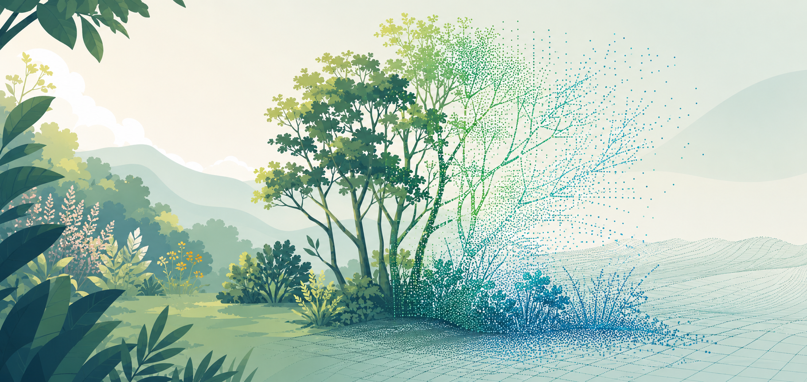

---
hide:
  - navigation
  - toc
---

{ .no-frame .pg-cover }

# Phytograph

A desktop application for measuring, comparing, and modeling plant
architecture from LiDAR scans — built for plant scientists who work with
point clouds, meshes, skeletons, and procedural plant models.

- :material-cube-scan: **Import LiDAR scans**

    Drag and drop `.las`, `.laz`, `.e57`, `.ptx`, `.ply`, `.pcd`, or ASCII
    (`.xyz`, `.txt`, `.csv`, `.pts`, `.asc`) point clouds into a 3D viewer
    that handles tens of millions of points. RIEGL `.riproject` and `.PROJ`
    scanner projects import directly.

- :material-broom: **Clean and prepare**

    Transform, crop, erase, filter, resample, and cross-section a cloud —
    then backfill the sky/miss rays that leaf area density depends on.

- :material-compare: **Register and compare**

    Auto-register rotated scans, refine with ICP, and stitch overlaps into
    one cloud — with cloud-to-mesh distance statistics (mean, median,
    percentiles, and coverage at fractions of the bounding-box diagonal).

- :material-layers: **Segment scans**

    Classify ground with a cloth simulation filter, separate wood from
    leaf, and split a plot into individual trees — then carry the labels
    through the rest of the pipeline.

- :material-brush: **Label points by hand**

    Paint your own classes with a lasso or brush to correct a classifier
    or build ground truth, with per-class counts and undo.

- :material-angle-acute: **Measure leaf angles**

    Triangulate a leaf-on scan into leaf surfaces and read their
    orientations — inclination and azimuth distributions, canonical de Wit
    fits, and the *G(θ)* that leaf area density depends on. The same
    triangulation also reconstructs branch and canopy surfaces.

- :material-tree: **Extract skeletons**

    Pull topological skeletons out of woody scans, with branch order
    colored by Strahler number and total length reported.

- :phytograph-qsm: **Build QSMs**

    Reconstruct dormant trees as connected cylinders with fitted radii,
    segment continuous shoots, and classify them by shoot rank — with
    woody volume, trunk diameter, and per-rank metrics. Add leaves by
    phyllotaxis and match a measured leaf-angle distribution.

- :material-grid: **Measure canopy structure**

    Invert overlapping scans into a voxel grid of leaf area density
    (m²/m³), and fit crown shapes (ellipsoid, prism, cone, alpha shape)
    for height and volume.

- :material-terrain: **Model the terrain**

    Grid classified ground returns into a bare-earth DEM/DTM — with
    hillshade, slope, and aspect layers — plus the top-of-canopy DSM and
    the canopy height model that comes from subtracting them.

- :material-sprout: **Generate procedural plants**

    Grow Helios plant models — trees, vines, cereals, vegetables, weeds —
    to a target age, then morph their parameters interactively.

- :material-radar: **Simulate a scan**

    Place virtual scanners around a plant and synthesize the point cloud
    they would produce, with full control over beam geometry.

<a href="guide/" class="md-button md-button--primary">Start the User Guide →</a>
&nbsp;
<a href="workflows/" class="md-button">Browse workflows</a>

---

Phytograph is developed at the
<a href="https://baileylab.ucdavis.edu/">Bailey Lab</a> at UC Davis.
Source code at
<a href="https://github.com/PlantSimulationLab/Phytograph">github.com/PlantSimulationLab/Phytograph</a>.

