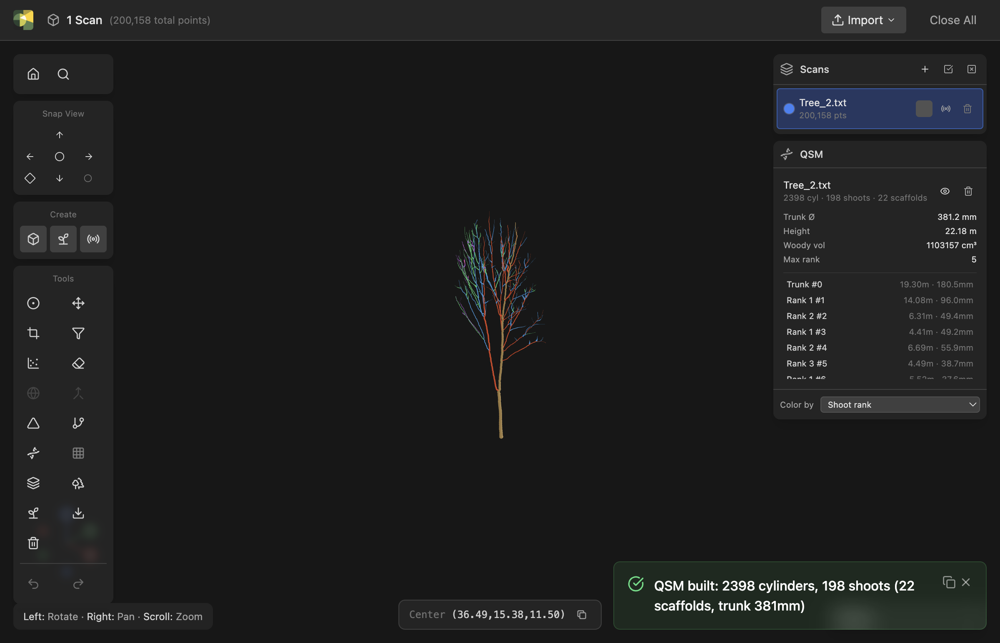
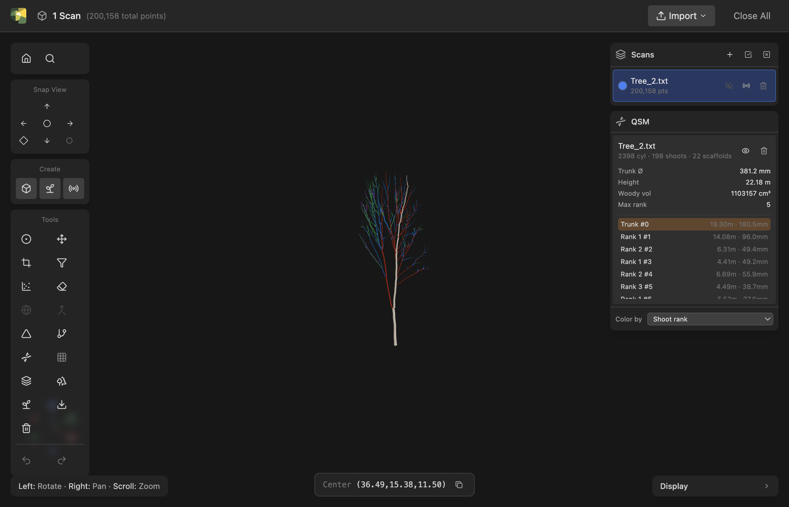
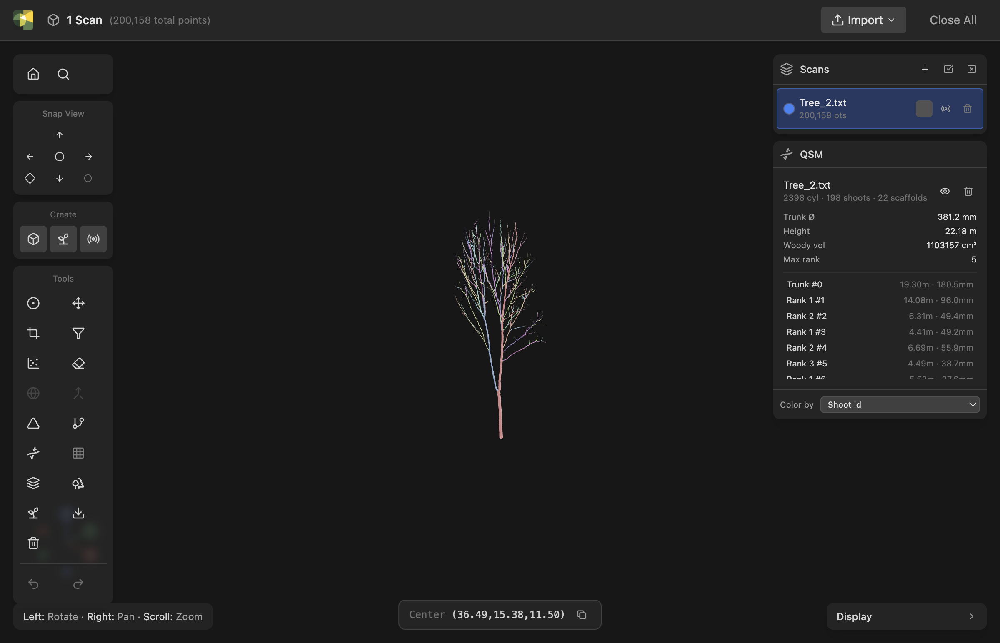

# Build a QSM

Reconstruct a woody scan as a **Quantitative Structure Model (QSM)**: a
set of connected cylinders with fitted radii and topology, where the
branches are grouped into **continuous shoots** and each shoot is
classified by **shoot rank** — trunk = 0, primary scaffolds = 1,
secondaries = 2, and so on.

A QSM goes further than a [skeleton](extract-skeleton.md). A skeleton
gives you the centerline graph and a Strahler order; a QSM gives you
**real wood**: per-cylinder radius, woody volume split into stem and
branches, trunk diameter, per-rank branch diameters and crotch angles —
the numbers an orchardist or phenotyping researcher actually reports.

!!! info "Built for dormant trees"
    The pipeline is designed for **dormant (leaf-off)** terrestrial-LiDAR
    scans. Leaf-off means no foliage clutter, so the woody structure
    reconstructs cleanly. You *can* run it on a leafy scan, but the
    leaves will be fit as spurious branches — separate the wood first
    (see [Separate leaf and wood](segment-wood.md)) for a clean result.

## Inputs

You need a **point cloud** of a woody plant — typically a TLS scan with
the ground removed. Good coverage helps: the radius and topology are only
as good as the points the scanner saw. One-sided / heavily occluded
trunks are handled (the radius model leans on structural reasoning where
the points run out — see [How it works](#how-it-works)), but more
coverage is always better.

If your scan still has leaves, ground, or other trees in it, clean it
first:

- [Segment ground points](segment-ground.md) and remove the ground.
- [Separate leaf and wood](segment-wood.md), then keep the wood.
- [Segment individual trees](segment-trees.md) if several trees share the
  cloud, and build one QSM per tree.

## Run the build

1. Select the cloud in the **Scans** panel.
2. Click **Build QSM** (the DNA-helix icon in the left toolbar), or open
   the command palette (<kbd>Ctrl</kbd>+<kbd>K</kbd>) and search for
   *Build QSM*.
3. The **Build QSM** panel opens on the right.

4. Set the **Twig radius** — the diameter the radius taper is anchored to
   at the branch tips. This is a per-species number (orchard cultivars
   aren't in any reference database, so you supply it). The default
   **4.23 mm** is a published example value; if you know your species'
   typical twig diameter, set it. It mainly affects the thinnest tips, not
   the trunk or scaffolds.
5. Click **Build QSM**.

The build runs the full pipeline on the backend (skeleton → shoot
segmentation → cylinder fitting → radius correction → metrics). On a
typical dormant tree this takes a few seconds to a minute. Large clouds
are automatically downsampled to 60,000 points first — dormant trees are
sparse enough that this is plenty for an accurate model.

!!! tip "Minimum data"
    The build needs at least **50 points**. Below that — or if the cloud
    is too sparse / disconnected for the skeleton to reach the crown —
    you'll get a clear error rather than a garbage model.

## Read the result

A new entry appears in the **QSM** results panel (lower-right), and the
cylinder model renders in the viewer, colored by shoot rank.

The results panel reports, per QSM:

- **Cylinder / shoot / scaffold counts** (the row subtitle).
- **Trunk Ø** — trunk diameter at the base, in mm.
- **Height** — vertical extent of the woody structure, in m.
- **Woody vol** — total woody volume, in cm³.
- **Max rank** — the deepest branching order recovered.
- A **shoot list** — every continuous shoot with its rank, length, and
  length-weighted mean diameter. The trunk is labelled **Trunk #0**;
  scaffolds are **Rank 1 #…**, and so on.

### Inspect one shoot

Click any row in the shoot list to **highlight that whole continuous
axis** in the viewer (the rest dims). This is the most direct way to see
what "shoot" means: a shoot follows one botanical axis straight through
every fork where smaller branches peel off, keeping its rank, rather than
restarting at each junction.

### Switch the coloring

The **Color by** dropdown at the bottom of the QSM panel offers two
modes:

- **Shoot rank** (default) — colors by branching order: a wood-tan trunk
  (rank 0), red-orange scaffolds (rank 1), then blue, green, violet, pink
  for deeper ranks. Best for reading *structure*.
- **Shoot id** — gives every shoot its own distinct color, so each
  continuous axis reads as one object regardless of rank. Best for
  *seeing the shoots themselves*.

See [Color modes → QSM](../reference/color-modes.md#qsm-color-modes) for
the full palette.

## Multi-view scans of one tree

A single tree is often captured from several scanner positions. You have
two ways to handle that, shown when you select **more than one scan**
before opening the panel:

| Mode | What it does | Use when |
|---|---|---|
| **One QSM from all scans** | Fuses the selected scans into a single cloud in world space and builds **one** QSM | The scans are multiple views of **one tree** — they must already be aligned (see [Register & compare](register-compare.md)) |
| **One QSM per scan** | Builds a **separate** QSM for each selected scan, in sequence | The scans are **different trees** |

Aggregating multi-view scans gives the most complete model — each scanner
position fills in wood the others couldn't see, which directly improves
radius accuracy on otherwise one-sided trunks. **Align the scans first**:
the fuse concatenates them in world coordinates and trusts that
registration.

## Export

A QSM lives in the current viewer session and is **not** persisted when
you close the app — but you can **export it to a file** to keep the model
or take it into other tooling.

1. Click the **Export** (download) icon at the top of the **QSM** results
   panel.
2. In the export dialog, pick a **format**, then tick which QSMs to write
   (all are selected by default — use **Select all / Select none** to
   toggle).
3. Click **Export** and choose a **folder**. One file is written per
   selected QSM, named after the source scan.

| Format | What it is | Use it for |
|---|---|---|
| **CSV** | One row per cylinder — `ID, parentID, branchID, branchOrder`, start/end coordinates, axis, radius, length, plus surface-coverage and fit residual. Uses the **SimpleForest** column layout. | Analysis and round-tripping into the standard QSM ecosystem: it imports directly into [rTwig](https://aidanmorales.github.io/rTwig/) (`import_qsm`) and [aRchi](https://github.com/umr-amap/aRchi) (`read_QSM(model = "simpleforest")`) — the TreeQSM-compatible path. |
| **OBJ** | Triangulated cylinder mesh. | Viewing the model anywhere — Blender, CloudCompare, MeshLab, Rhino. |
| **PLY** | The same cylinder mesh, with each face tagged by **branch order** and **radius**. | Viewing with attribute-based coloring (color faces by branching order in CloudCompare/Blender). |

!!! note "Coordinates and units"
    Exports are in the cloud's **world coordinates**, in **metres**. The
    CSV root cylinder has `parentID = -1`.

## How it works

The QSM pipeline is a **clean-room, non-ML, fully deterministic**
reconstruction (same cloud in → identical model out). It runs five
stages; this section explains what each does, the design decisions behind
them, and the hard-coded parameters you can't see in the UI.

### The five stages

1. **Skeleton (geodesic level-set).** A neighbor graph is built over the
   points (a k-d tree radius graph), true geodesic distance from the tree
   base is computed with Dijkstra, and points are binned into level sets
   by that distance. Each connected component in a level becomes one
   skeleton node; adjacent levels are linked into a rooted, acyclic tree.
   Occlusion gaps that would disconnect the crown are **bridged** so the
   geodesic field still reaches it. This is deterministic by construction
   — no iterative contraction, no RNG.

2. **Shoot segmentation + rank (the headline).** The skeleton is
   collapsed into **segments** (chains between forks). Each segment's
   **GrowthLength** — its own length plus everything it supports distally
   — is computed in one pass. At every fork, the **continuation child** is
   the one with the **largest GrowthLength**; it inherits the parent's
   shoot and rank, while every other child starts a **new shoot at
   rank + 1**. A shoot is then a maximal chain of continuation-linked
   segments, and its rank is the number of forks between it and the base.

    !!! note "Why largest-subtree, not thickest or straightest?"
        The continuation rule decides which way an axis "keeps going."
        Phytograph uses the **largest-GrowthLength** child (the rule used
        by aRchi and SimpleForest) because it is the most robust under
        noisy radii and angle jitter — a thicker or straighter *sibling*
        will **not** steal the leader. The rule is actually a weighted
        score `w_L·GrowthLength + w_A·CrossSection + w_θ·colinearity`, but
        the validated default weights are `(1, 0, 0)` — pure
        largest-subtree.

3. **Cylinder fitting.** Each cloud point is assigned to the cylinder
   whose axis is nearest (a global nearest-cylinder competition, so a
   branch keeps its own bark instead of being absorbed by the trunk), and
   a robust least-squares cylinder is fit to each cylinder's points. The
   fit is a deterministic Huber/IRLS M-estimator (not RANSAC). Each
   cylinder also gets two quality numbers: **surface coverage** (`surf_cov`
   — what fraction of its surface the scanner actually saw; low means
   one-sided/occluded) and **mad** (mean fit residual).

4. **Radius correction.** Raw per-cylinder fits are locally noisy and, on
   occluded wood, biased. This stage turns them into a coherent radius
   field with three principled ingredients:

    - **Per-shoot monotone taper** — a shoot's radius must shrink from
      base to tip. An isotonic (PAVA) fit, weighted by surface coverage,
      forces that. The taper is keyed to **distance from the base**, not
      GrowthLength (GrowthLength drops at every fork, which used to make a
      still-thick trunk go thin right after a big branch).
    - **Pipe-model lower bound** — a parent must be at least as fat as the
      wood it carries, propagated tip→base. This keeps a heavily occluded
      trunk thick *by construction* from the branches it supports, instead
      of collapsing to the minimum radius.
    - **Twig anchor** — leaf cylinders are floored at the twig radius you
      set, so tips don't taper to zero.

    The correction **only changes radius** — topology, shoots, and ranks
    are never touched.

5. **Metrics.** The horticultural summary you see in the results panel —
   TCSA, trunk diameter, height, scaffold count, per-rank length /
   diameter / crotch angle, and woody volume split into stem vs. branch.

### Hard-coded parameters

Everything except **twig radius** (and the hidden continuation weights) is
fixed at a validated default. The most relevant:

| Parameter | Value | What it controls |
|---|---|---|
| Min points to build | 50 | Below this the build refuses |
| Point cap | 60,000 | Clouds are downsampled to this before building |
| Twig radius (UI) | 4.23 mm | Tip diameter the taper is anchored to |
| Continuation weights | (1, 0, 0) | Largest-GrowthLength axis rule |
| Short-branch prune | 0.10 m | Leaf fragments shorter than this are dropped as skeleton noise |
| Cylinder fit | Huber IRLS, k = 1.345 | Robust M-estimator (no RANSAC) |
| Point→cylinder cutoff | 0.5 m | Points farther than this from any axis are ignored (other trees, ground) |
| Surface-coverage trust | 0.7 | At/above this a fitted radius is trusted; below it leans on the taper / pipe-model |
| Pipe-model exponent | 2.5 | `r_parent ≥ (Σ r_child^k)^(1/k)` — slightly above area conservation |

### Known limitations

These are honest, validated behaviors — not bugs:

- **Determinate trunks** (a short trunk ending in a whorl of scaffolds):
  the largest-subtree rule can carry rank 0 a little way up one scaffold,
  so the "trunk" shoot slightly over-extends. The trade-off is deliberate
  — tightening it would lose real scaffolds. **Central-leader** trees (a
  trunk that genuinely continues to the apex) are tracked perfectly.
- **The finest twigs** can merge into their parent where the skeleton's
  resolution runs out. Total branch *length* is still recovered even when
  the tip *count* is low.
- **Branch radius under heavy occlusion** is reported with more
  uncertainty than the trunk; this is why woody volume is split into
  **stem vs. branch** — the stem number is the trustworthy one.

## Common problems

**"It says the cloud is too sparse / produced no nodes."**
The skeleton couldn't connect the crown to the base. Make sure the ground
is removed but the trunk base is intact, and that the cloud isn't so
decimated that branches are disconnected. Aggregating multiple scan
positions helps.

**"The trunk radius looks too thin / too thick."**
On a one-sided scan the trunk's own points are unreliable; the model
leans on the pipe-model from the branches it carries. More scan coverage
(aggregate multiple views) is the real fix. The trunk diameter the panel
reports is measured at the base.

**"A scaffold got colored like the trunk (rank 0)."**
That's the determinate-trunk limitation above — the leader continued up a
scaffold. Switch to **Shoot id** coloring to see the actual shoot
boundaries.

## What's next

- Compare the QSM's metrics to a [generated plant model](generate-plant.md)
  of the same species.
- Read the [QSM concept page](../concepts/qsm.md) for how cylinders,
  shoots, and ranks relate to skeletons and meshes.
